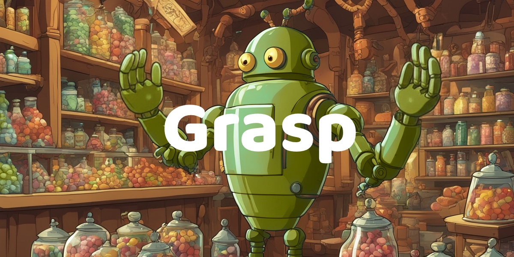

# Grasp.py – Explainable AI

**Grasp** is a lightweight AI toolkit for Python, with tools for data mining, natural language processing (NLP), machine learning (ML) and network analysis. It has 300+ fast and essential algorithms, with ~25 lines of code per function, self-explanatory function names, no dependencies, bundled into one well-documented file: [grasp.py](https://github.com/textgain/grasp/blob/master/grasp.py) (250KB). Or install with [pip](https://pip.pypa.io/en/stable/getting-started), including language models (50MB):

```
$ pip install git+https://github.com/textgain/grasp
```

## Tools for Data Mining

**Download stuff** with `download(url)` (or `dl`), with built-in caching and logging:

```python
src = dl('https://www.textgain.com', cached=True)
```

**Parse HTML** with `dom(html)` into an `Element` tree and search it with [CSS Selectors](https://developer.mozilla.org/en-US/docs/Web/CSS/CSS_Selectors):

```py
for e in dom(src)('a[href^="http"]'): # external links
    print(e.href)
```

**Strip HTML** with `plain(Element)` to get a plain text string:

```py
for word, count in wc(plain(dom(src))).items():
    print(word, count)
```

**Find articles** with `wikipedia(str)`, in HTML:

```py
for e in dom(wikipedia('cat', language='en'))('p'):
    print(plain(e))
```

**Find opinions** with `twitter.seach(str)`:

```py
for tweet in first(10, twitter.search('from:textgain')): # latest 10
    print(tweet.id, tweet.text, tweet.date)
```

**Deploy APIs** with `App`. Works with WSGI and Nginx:

```py
app = App()
```

```py
@app.route('/')
def index(*path, **query):
    return 'Hi! %s %s' % (path, query)
```

```py
app.run('127.0.0.1', 8080, debug=True)
```

Once this app is up, go check [http://127.0.0.1:8080/app?q=cat](http://127.0.0.1:8080/app?q=cat).

## Tools for Natural Language Processing

**Get language** with `lang(str)` for 40+ languages and ~92.5% accuracy:

```py
print(lang('The cat sat on the mat.')) # {'en': 0.99}
```

**Get locations** with `loc(str)` for 25K+ EU cities:

```py
print(loc('The cat lives in Catena.')) # {('Catena', 'IT', 43.8, 11.0): 1}
```

**Get words & sentences** with `tok(str)` (tokenize) at ~125K words/sec:

```py
print(tok("Mr. etc. aren't sentence breaks! ;) This is:.", language='en'))
```

**Get word polarity** with `pov(str)` (point-of-view). Is it a positive or negative opinion?

```py
print(pov(tok('Nice!', language='en'))) # +0.6
print(pov(tok('Dumb.', language='en'))) # -0.4
```

* For de, en, es, fr, nl, with ~75% accuracy.
* You'll need the language models in [grasp/lm](https://github.com/textgain/grasp/tree/master/lm).

**Tag word types** with `tag(str)` in 10+ languages using robust ML models from [UD](https://universaldependencies.org):

```py
for word, pos in tag(tok('The cat sat on the mat.'), language='en'):
    print(word, pos)
```

* Parts-of-speech include `NOUN`, `VERB`, `ADJ`, `ADV`, `DET`, `PRON`, `PREP`, ...
* For ar, da, de, en, es, fr, it, nl, no, pl, pt, ru, sv, tr, with ~95% accuracy.
* You'll need the language models in [grasp/lm](https://github.com/textgain/grasp/tree/master/lm).


**Tag keywords** with `trie`, a compiled dict that scans ~250K words/sec:

```py
t = trie({'cat*': 1, 'mat' : 2})
```
```py
for i, j, k, v in t.search('Cats love catnip.', etc='*'):
    print(i, j, k, v)
```

**Get answers** with `gpt()`. You'll need an [OpenAI](https://platform.openai.com/) API key.

```py
print(gpt("Why do cats sit on mats? (you're a psychologist)", key='...'))
```

## Tools for Machine Learning

Machine Learning (ML) algorithms learn by example. If you show them 10K spam and 10K real emails (i.e., train a model), they can predict whether other emails are also spam or not.

Each training example is a `{feature: weight}` dict with a label. For text, the features could be words, the weights could be word count, and the label might be _real_ or _spam_.


**Quantify text** with `vec(str)` (vectorize) into a `{feature: weight}` dict:

```py
v1 = vec('I love cats! 😀', features=('c3', 'w1'))
v2 = vec('I hate cats! 😡', features=('c3', 'w1'))
```

* `c1`, `c2`, `c3` count consecutive characters. For `c2`, _cats_ → 1x _ca_, 1x _at_, 1x _ts_.
* `w1`, `w2`, `w3` count consecutive words. 

**Train models** with `fit(examples)`, save as JSON, predict labels: 

```py
m = fit([(v1, '+'), (v2, '-')], model=Perceptron) # DecisionTree, KNN, ...
```

```py
m.save('opinion.json')
```

```py
m = fit(open('opinion.json'))
```

```py
print(m.predict(vec('She hates dogs.')) # {'+': 0.4: , '-': 0.6}
```

Once trained, `Model.predict(vector)` returns a dict with label probabilities (0.0–1.0). 

## Tools for Network Analysis

**Map networks** with `Graph`, a `{node1: {node2: weight}}` dict subclass:

```py
g = Graph(directed=True)
```

```py
g.add('a', 'b') # a → b
g.add('b', 'c') # b → c
g.add('b', 'd') # b → d
g.add('c', 'd') # c → d
```

```py
print(g.sp('a', 'd')) # shortest path: a → b → d
```

```py
print(top(pagerank(g))) # strongest node: d, 0.8
```

**See networks** with `viz(graph)`:

```py
with open('g.html', 'w') as f:
    f.write(viz(g, src='graph.js'))
```

You'll need to set `src` to the [grasp/graph.js](https://github.com/textgain/grasp/blob/master/graph.js) lib.

## Tools for Comfort

**Easy date** handling with `date(v)`, where `v` is an int, a str, or another date:

```py
print(date('Mon Jan 31 10:00:00 +0000 2000', format='%Y-%m-%d'))
```

**Easy path** handling with `cd(...)`, which always points to the script's folder:

```py
print(cd('kb', 'en-loc.csv')
```

**Easy CSV** handling with `csv([path])`, a list of lists of values:

```py
for code, country, _, _, _, _, _ in csv(cd('kb', 'en-loc.csv')):
    print(code, country)
```

```py
data = csv()
data.append(('cat', 'Kitty'))
data.append(('cat', 'Simba'))
data.save(cd('cats.csv'))
```

## Tools for Good

A challenge in AI is bias introduced by human trainers. Remember the `Model` trained earlier? Grasp has tools to **explain** how & why it makes decisions:

```py
print(explain(vec('She hates dogs.'), m)) # why so negative?
```

In the returned dict, the model's explanation is: “you wrote _hat_ + _ate_ (_hate_)”.